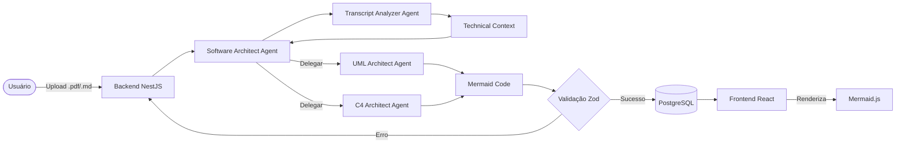

# 🏗️ M2A — Meeting to Architecture


> Transforme transcrições de reuniões em diagramas de arquitetura UML e C4 automaticamente com IA.

O **M2A (Meeting to Architecture)** é uma plataforma SaaS projetada para eliminar o trabalho manual de documentação técnica. Utilizando uma arquitetura de multi-agentes inteligentes (Google Gemini + ADK), o M2A processa transcrições de reuniões (.md ou .pdf) e gera diagramas profissionais em formato Mermaid, prontos para serem integrados ao seu repositório.



## ✨ O Problema
Documentar a arquitetura de um sistema após reuniões de design costuma ser uma tarefa lenta, sujeita a falhas humanas e frequentemente negligenciada. Transcrições de reuniões (Google Meet, Zoom, Teams) são ricas em detalhes, mas extrair essa estrutura manualmente para diagramas UML ou C4 exige tempo que os desenvolvedores prefeririam usar codificando.

## 🚀 A Solução
O M2A automatiza esse fluxo. Ao subir uma transcrição, a IA analisa o contexto técnico, identifica entidades, fluxos e componentes, e gera o código Mermaid correspondente. O sistema permite a gestão de times, fluxos de aprovação de diagramas e versionamento dos prompts, garantindo que a documentação gerada seja precisa e auditável.

## 🎯 Diferenciais
- **Fluxo Zero Etapas Manuais**: Upload → Seleção do tipo → Diagrama pronto.
- **Arquitetura Multi-Agente**: Especialistas dedicados para análise, UML e C4.
- **Gestão de Times**: Papéis inspirados no GitHub (Admin, Maintainer, Member).
- **Fluxo de Aprovação**: Controle de qualidade antes do diagrama entrar para o acervo oficial.
- **Segurança Enterprise**: Dados não são usados para treinamento da IA (API Gemini Enterprise), senhas com bcrypt e isolamento total por time.
- **Circuit Breaker**: Resiliência contra falhas ou limites da API do Gemini.

## 🛠️ Stack
- **Frontend**: React 18, Vite, TypeScript, TanStack Router, Primer React (GitHub Design System), TailwindCSS, Mermaid.js.
- **Backend**: NestJS 11, TypeScript, @google/adk (Agents SDK), JWT, Multer, Prisma ORM.
- **Banco de dados**: PostgreSQL (via Docker ou Supabase).
- **IA**: Google Gemini (modelos `gemini-1.5-flash` ou superiores).
- **Infra**: Docker & Docker Compose com suporte a profiles.

## 🏛️ Arquitetura de Agentes
O projeto utiliza o **@google/adk** para orquestrar quatro agentes especializados:

1.  **Software Architect (Orchestrator)**: O cérebro da operação. Recebe a solicitação, coordena o fluxo e decide qual agente especializado deve ser chamado após a análise inicial.
2.  **Transcript Analyzer**: Responsável por ler o documento bruto e extrair o "Technical Context" — entidades, tecnologias citadas, fluxos de dados e requisitos.
3.  **UML Architect**: Especialista em transformar o contexto técnico em sintaxe Mermaid para diagramas UML (Classe, Sequência, Estado, etc.).
4.  **C4 Architect**: Especialista em arquitetura de sistemas em larga escala, focado nos níveis de Contexto, Container, Componente e Código do modelo C4.

## 📁 Estrutura do Monorepo
```text
.
├── apps/
│   ├── api/          # Backend NestJS (M2A API)
│   │   ├── prisma/   # Schema e Migrations do banco de dados
│   │   └── src/      # Módulos: Auth, Users, Teams, Diagrams, Agents
│   └── web/          # Frontend React + Vite
│       └── src/      # Features: Auth, Teams, Diagrams, Landing
├── docker-compose.yml # Orquestração da stack completa
└── package.json      # Scripts globais do monorepo
```

## ⚡ Quick Start (recomendado: Docker)

### Pré-requisitos
- Docker e Docker Compose v2+
- Google Gemini API Key

### 1. Clone e configure
```bash
git clone https://github.com/seu-usuario/m2a.git
cd m2a
cp apps/api/.env.example apps/api/.env
```
Edite `apps/api/.env` e insira sua `GEMINI_API_KEY`.

### 2. Subir com Docker (Stack Completa)
```bash
docker compose --profile db --profile api --profile web up -d --build
```

### 3. Subir partes separadas
- **Apenas Banco**: `docker compose --profile db up -d`
- **Apenas API**: `docker compose --profile api up -d`
- **Apenas Web**: `docker compose --profile web up -d`

| Serviço | URL | Porta |
| :--- | :--- | :--- |
| **Frontend** | http://localhost:8080 | 8080 |
| **Backend API** | http://localhost:3000 | 3000 |
| **PostgreSQL** | localhost:5433 | 5433 |

### 4. Derrubando a stack
Para parar todos os serviços e manter os dados do banco:
```bash
docker compose --profile db --profile api --profile web down
```

Para remover tudo, incluindo os volumes de dados:
```bash
docker compose --profile db --profile api --profile web down -v
```

## 💻 Rodando Localmente (sem Docker)

### Pré-requisitos
- Node.js v20+
- PostgreSQL rodando localmente (ou via profile `db` do Docker)

### Instalação passo a passo
1. **Instalar dependências**:
   ```bash
   npm install
   ```
2. **Configurar o Banco**:
   Ajuste o `DATABASE_URL` no `.env` da API e rode as migrations:
   ```bash
   npm run --prefix apps/api prisma migrate deploy
   ```
3. **Iniciando os serviços**:
   ```bash
   npm run dev:api  # Terminal 1
   npm run dev:web  # Terminal 2
   ```

## 🔌 API Reference

### 🔐 Auth
| Método | Rota | Descrição | Auth |
| :--- | :--- | :--- | :--- |
| `POST` | `/auth/login` | Login e geração de token JWT | ❌ |

**Exemplo de Request:**
```json
{
  "email": "dev@example.com",
  "password": "strongpassword"
}
```

---

### 👤 Users
| Método | Rota | Descrição | Auth |
| :--- | :--- | :--- | :--- |
| `POST` | `/user` | Cadastro de novo usuário | ❌ |
| `GET` | `/user/me` | Dados do usuário logado | ✅ |

**Exemplo de Response (`GET /user/me`):**
```json
{
  "id": "uuid-v4",
  "name": "Jane Doe",
  "email": "jane@m2a.com",
  "isActive": true
}
```

---

### 👥 Teams
| Método | Rota | Descrição | Auth |
| :--- | :--- | :--- | :--- |
| `GET` | `/teams` | Lista times que o usuário participa | ✅ |
| `POST` | `/teams` | Cria um novo time | ✅ |
| `POST` | `/teams/:id/invite` | Convida usuário por e-mail | ✅ (Admin) |

---

### 📊 Diagrams
| Método | Rota | Descrição | Auth |
| :--- | :--- | :--- | :--- |
| `GET` | `/diagrams` | Seus diagramas pessoais | ✅ |
| `DELETE` | `/diagrams/:id` | Soft delete (lixeira) | ✅ |
| `POST` | `/diagrams/:id/add-to-team` | Solicita inclusão no time | ✅ |

---

### 🤖 Agents
| Método | Rota | Descrição | Auth |
| :--- | :--- | :--- | :--- |
| `POST` | `/agents/generate` | Gera diagrama via IA (Multipart) | ✅ |

**Request Body (Multipart):**
- `file`: Arquivo `.md` ou `.pdf`
- `diagramType`: Enum (ex: `CLASS`, `C4_CONTAINER`)

---

## 🗂️ Variáveis de Ambiente

| Variável | Descrição | Obrigatória | Default |
| :--- | :--- | :--- | :--- |
| `DATABASE_URL` | String de conexão PostgreSQL | Sim | - |
| `GEMINI_API_KEY` | Sua chave do Google AI Studio | Sim | - |
| `GEMINI_MODEL` | Modelo utilizado | Não | `gemini-1.5-flash` |
| `JWT_SECRET` | Segredo para tokens JWT | Sim | - |
| `VITE_API_URL` | URL da API para o Frontend | Sim | `http://localhost:3000` |

## 🔒 Segurança
- **Isolamento**: Cada time possui seu próprio namespace de dados.
- **Auditabilidade**: Prompts dos agentes estão em arquivos Markdown no código.
- **Validação**: Todas as respostas da IA passam por um parser Zod antes de chegar ao banco.
- **Criptografia**: Senhas nunca são salvas em texto plano (bcrypt).

## 📊 Tipos de Diagrama Suportados

| Categoria | Tipos |
| :--- | :--- |
| **UML Structural** | CLASS, PACKAGE, OBJECT, COMPONENT, DEPLOYMENT, COMPOSITE_STRUCTURE |
| **UML Behavioral** | ACTIVITY, SEQUENCE, COMMUNICATION, INTERACTION_OVERVIEW, TIMING, USE_CASE, STATE |
| **C4 Model** | C4_CONTEXT, C4_CONTAINER, C4_COMPONENT, C4_CODE |

## 🤝 Contribuindo
1. Fork o projeto
2. Crie uma branch para sua feature (`git checkout -b feature/nova-feature`)
3. Commit suas mudanças (`git commit -m 'Add: nova feature'`)
4. Push para a branch (`git push origin feature/nova-feature`)
5. Abra um Pull Request

## 📄 Licença
Distribuído sob a licença MIT. Veja `LICENSE` para mais informações.

---
Feito com ❤️ por @matheusnascimentods
